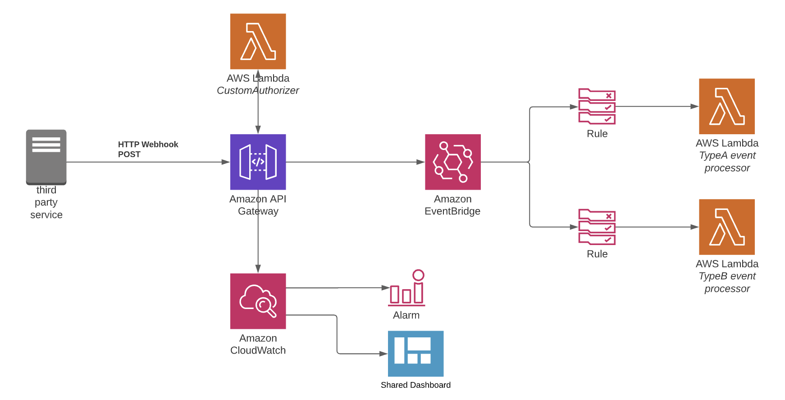

# Webhook

Every application needs to interact with an ecosystem of 3rd party SaaS providers.
Implementing a webhook HTTP endpoint in your application allows this ecosystem of external applications to notify you. Your application can then react to those notifications and perform tasks accordingly.

## Quick start

```yaml
service: my-app
provider:
    name: aws

constructs:
    stripe:
        type: webhook
        authorizer:
            handler: myAuthorizer.main
        path: /my-webhook-endpoint

plugins:
    - serverless-lift
```

## How it works

Each webhook construct deploys the following resources:
- an **API Gateway V2 HTTP API and its $default stage**
- an **EventBridge EventBus**
- an **IAM Role** allowing API Gateway to use `PutEvents` API of Eventbridge
- an **API Gateway V2 route** 
- an **API Gateway V2 integration** defining mappings of parameters between the HTTP request body and the Eventbridge  Event's body
- a **custom Lambda authorizer** to handle signature verification at API Gateway level



## Variables

Each webhook construct exposes the following variable:

- `busName`: the name of the deployed EventBridge bus

This can be used to reference the bus on which notification are published, for example:

```yaml
constructs:
    stripe:
        # ...

functions:
    myConsumer:
        handler: src/stripeConsumer.handler
        events:
            -   eventBridge:
                    eventBus: ${construct:stripe.busName}
                    pattern:
                        source:
                            # filter all events received on stripe webhook
                            - stripe
                        detail-type:
                            - invoice.paid
```

_How it works: the `${construct:stripe.busName}` variable will automatically be replaced with a CloudFormation reference to the EventBridge bus._

## Configuration reference

### Path

_Required_

```yaml
constructs:
    stripe:
        type: webhook
        path: /my-path
```

The endpoint your webhook should be exposed on. Always starts with a `/`.
The final URL for the webhook endpoint will be displayed in the information section when running a `serverless deploy` command and will be `https://{id}.execute-api.{region}.amazonaws.com{path}`

### Authorizer

_Conditional - depends on `insecure` value_

```yaml
constructs:
    stripe:
        # ...
        authorizer:
            handler: stripe/authorizer.main
```

The `authorizer` is a Lambda function that checks that webhooks are valid.

_Note: the "authorizer" Lambda function is configured inside the webhook construct, instead of being defined in the `functions` section._

The only required value is the `handler`: this should point to the code that authenticate 3rd party notification. The handler will receive an event from API Gateway using [payload format v2](https://docs.aws.amazon.com/apigateway/latest/developerguide/http-api-lambda-authorizer.html#http-api-lambda-authorizer.payload-format). The handler [should be written to return the expected simple payload format](https://docs.aws.amazon.com/apigateway/latest/developerguide/http-api-lambda-authorizer.html#http-api-lambda-authorizer.payload-format-response).

```js
const authorizer = (event, context, callback) => {
  callback(null, {
    "isAuthorized": true,
  });
}
```

[All settings allowed for functions](https://www.serverless.com/framework/docs/providers/aws/guide/functions/) can be used under the `authorizer` key. For example:

```yaml
constructs:
    stripe:
        # ...
        authorizer:
            handler: stripe/authorizer.main
            environment:
                STRIPE_SECRET: my-secret
```

**Lift will automatically configure the function to be triggered by API Gateway.** It is not necessary to define `events` on the function.

#### Disabling `authorizer`

_Optional_
Defaults to `false`.

It is possible to skip writing an `authorizer` function by setting `insecure: true`.

HTTP requests on the wehbook endpoint will not be validated. This setting is not recommended and SHOULD NOT BE USED IN PRODUCTION to prevent webhook injection as well as _Denial of Wallet attacks_.

```yaml
constructs:
    stripe:
        # ...
        insecure: true
```

### Event type

_Optional_
Defaults to `Webhook`.

Can either be a dynamic path selector:
```yaml
constructs:
    stripe:
        # ...
        eventType: $request.body.type
```

Or a static string:
```yaml
constructs:
    stripe:
        # ...
        eventType: stripe
```

Always favor dynamic path selector to ensure the minimum amount of compute is executed downstream. The list of available dynamic selector is available in [API Gateway documentation](https://docs.aws.amazon.com/apigateway/latest/developerguide/http-api-develop-integrations-aws-services.html#http-api-develop-integrations-aws-services-parameter-mapping).
